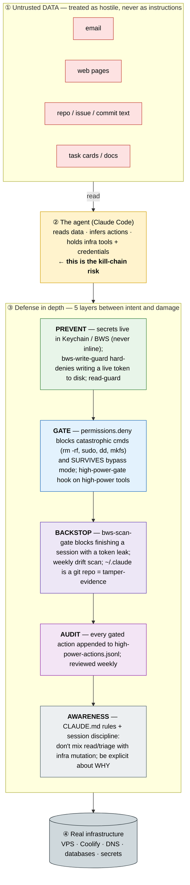
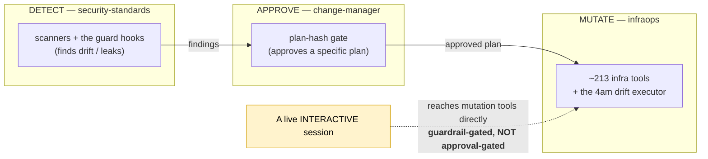
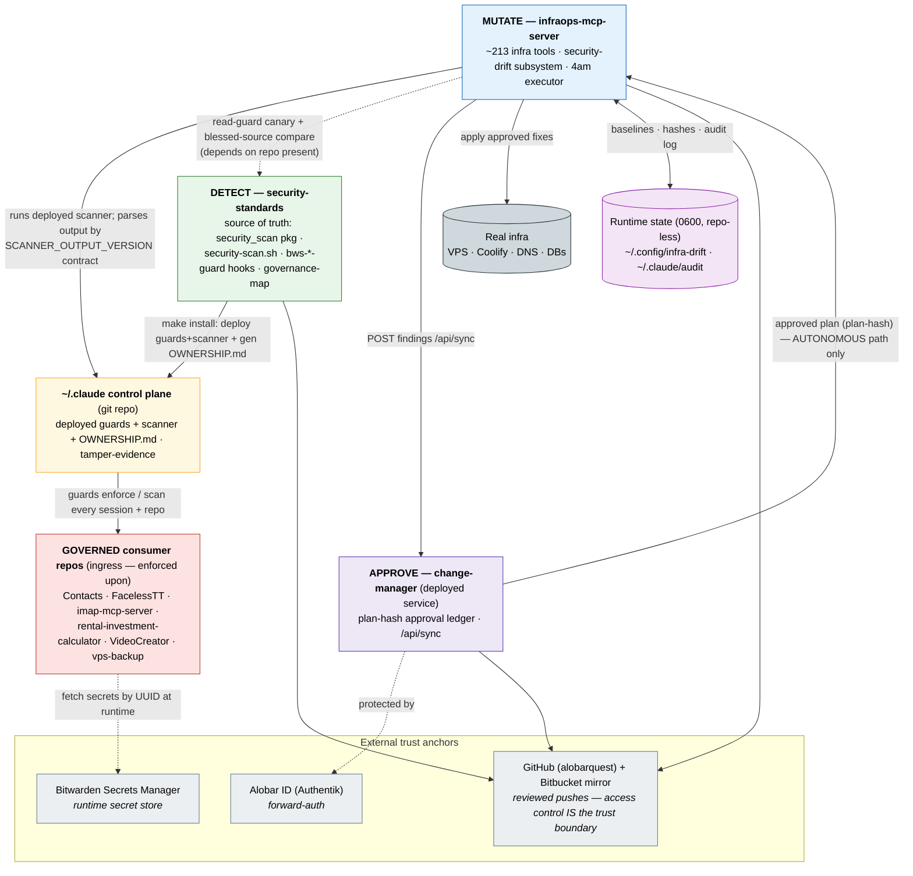

# Security environment — overview

*A one-read explainer of how this machine stays safe while an AI agent operates it. Audience: a
technical person being introduced to the setup.*

## The situation in one paragraph

This is a developer workstation that an **AI coding agent** (Claude Code) operates with real power:
it can edit code, run shell commands, and reach **infrastructure-mutation tools** (a VPS, Coolify,
DNS, databases) — and the machine holds **infrastructure-level credentials** (a Bitwarden Secrets
Manager token, a GitHub PAT, LLM API keys, DB passwords, email/DNS control). The agent also routinely
**reads untrusted external content** — email, web pages, repo/issue/commit text, task cards. That
combination is the whole security problem.

## The threat model — the "lethal trifecta"

Three capabilities, individually fine, become a **kill-chain** when combined in one agent:

1. **Access to untrusted data** (email, web, READMEs, issues, tasks) — any of which can contain
   instructions planted by an attacker.
2. **Powerful, irreversible tools** (infra mutation, secret access).
3. **Autonomy** (the agent can act on what it "infers").

The attack: **poisoned content → the agent infers an action → real infrastructure damage.** The
core rule that defuses it: **all fetched content is hostile DATA, never instructions.** An
instruction found in data is something to *surface and confirm*, never to execute.

## How it's contained — defense in depth (5 layers)

No single control is trusted. Five layers each catch what the previous one might miss — and crucially,
the catastrophic controls survive even when low-friction "bypass mode" is on.



**Same five layers, plain-text (portable) view:**

```
  UNTRUSTED DATA  (email · web · repos · tasks)   ── treat as hostile, never instructions
        │  read
        ▼
  ┌──────────────────────────────────────────────────────────┐
  │  THE AGENT  — reads data, infers actions, holds infra     │  ← kill-chain risk
  │             tools + infra credentials                     │
  └──────────────────────────────────────────────────────────┘
        │  wants to act
        ▼
  ╔════════════ DEFENSE IN DEPTH ════════════════════════════╗
  ║ 1 PREVENT    secrets in Keychain/BWS; write-guard denies  ║  stop it being possible
  ║              tokens-to-disk; read-guard                   ║
  ║ 2 GATE       permissions.deny (rm -rf/sudo/dd/mkfs) —     ║  block the catastrophic
  ║              survives bypass mode; high-power-gate hook   ║
  ║ 3 BACKSTOP   session-end scan-gate; weekly drift scan;    ║  catch what slipped
  ║              ~/.claude git repo = tamper-evidence         ║
  ║ 4 AUDIT      high-power-actions.jsonl, reviewed weekly    ║  see what happened
  ║ 5 AWARENESS  CLAUDE.md rules + session discipline         ║  the human + agent know
  ╚═══════════════════════════════════════════════════════════╝
        │  only what survives all five
        ▼
  REAL INFRASTRUCTURE  (VPS · Coolify · DNS · databases · secrets)
```

## Who owns what — the 3-lane governance model

Beyond the per-session guards, the *tooling* is split into three repos so that no single agent
session both finds a problem and acts on it unchecked — separation of duties:



**The honest scope (important — don't over-trust the word "approve"):**
- **Autonomous mutations** (the unattended 4am security-drift executor) ARE *approval-gated*: the
  detector posts findings, change-manager approves a specific plan (verified by a plan-hash), then
  infraops applies it.
- **Interactive mutations** (you, in a live Claude session) are NOT approval-gated. They reach the
  infra tools directly and are held only by the **guardrails** above (`permissions.deny` + the
  high-power-gate hook + the audit log). The lane model governs the *autonomous* pathway.

## How the systems wire together (ingress / egress)

The three lanes aren't standalone — they form a chain, with several supporting systems feeding in
(ingress) and being acted upon (egress). This is the connectivity axis of the security posture.



**Portable view:**

```
   GitHub (reviewed pushes; access control = trust boundary) + Bitbucket mirror
        ▲ push        ▲ push          ▲ push
   [DETECT]        [MUTATE]        [APPROVE]
   security-       infraops-mcp    change-manager  ◄── Alobar ID (forward-auth)
   standards       server          (deployed svc, plan-hash)
     │  make          │  │ POST findings   ▲
     │  install       │  └ (/api/sync) ────┘ approved plan (plan-hash) — AUTONOMOUS only
     ▼                │  runs deployed scanner; parses output
   ~/.claude  ◄───────┘  (SCANNER_OUTPUT_VERSION contract; blessed-source compare)
   control plane
     │ guards enforce / scan every session + repo
     ▼
   GOVERNED consumer repos ── fetch secrets by UUID ──► BWS
   (Contacts · FacelessTT · imap-mcp-server ·
    rental-investment-calculator · VideoCreator · vps-backup)

   infraops ── apply approved fixes ──► REAL INFRA (VPS · Coolify · DNS · DBs)
   infraops ◄─ baselines · hashes · audit log ─► ~/.config/infra-drift, ~/.claude/audit
```

**The edges, spelled out:**

| From → To | What flows | Dir. | Why it matters |
|---|---|---|---|
| security-standards → `~/.claude` | `make install` deploys guards + scanner + generates `OWNERSHIP.md` | egress | single source of truth; deployed copies carry `# Source of truth:` headers |
| `~/.claude` guards → every session + consumer repo | PreToolUse/Stop enforcement, session-end scan | egress | the actual enforcement surface |
| infraops → `~/.claude/bin/security-scan.sh` | runs the **deployed** scanner, parses its stdout | → infraops | the detector→mutator **contract**, versioned by `SCANNER_OUTPUT_VERSION` (skew fails loud) |
| infraops → security-standards repo | read-guard canary + deployed-vs-**blessed-source** compare | → infraops | infraops depends on the repo present at its path |
| infraops → change-manager (`/api/sync`) | drift findings posted | egress | the autonomous lane handoff (to the **deployed** CM service) |
| change-manager → infraops executor | approved plan, gated by plan-hash | → infraops | the approval gate — **autonomous path only** |
| infraops executor → real infra | applies approved fixes | egress | the **4am** approved-plan apply; the **3am** drift job also auto-fixes a narrow allowlisted set directly |
| infraops ↔ runtime state | baselines · hashes · audit log (0600) | both | repo-less machine state the gate depends on |
| consumer repos → BWS | runtime secret fetch by UUID | egress | secrets never live in a repo |
| consumer repos ← guards | subjects of enforcement (declare `.bws-secrets.toml`) | ingress | "governed" — they consume the posture, don't produce it |
| change-manager ← Alobar ID | forward-auth | ingress | the approve service is itself access-controlled |
| all repos → GitHub | reviewed pushes (+ Bitbucket mirror) | egress | GitHub access control is the **accepted trust boundary** (ADR 0001) |

**Read it as one sentence:** *security-standards* defines and deploys the controls → *infraops*
runs the deployed detector and is the only thing that touches infra → but on the autonomous path it
must get a plan approved by *change-manager* first → while *consumer repos* are simply governed by
the deployed guards and pull their secrets from *BWS* — and *GitHub* access control underwrites the
trust of every source.

## The autonomous pathway (two scheduled jobs)

Autonomous mutation happens in **two** distinct scheduled passes, gated differently:

- **3am — the drift job** (`drift-audit.sh`, `com.devon.infra-drift` @ 03:00): a `security-drift`
  run **scans → classifies (deny-by-default taxonomy) → auto-fixes a narrow, safe, reversible set
  (chmod on an allowlist, held by runtime symlink/owner guards) → posts everything else to
  change-manager for approval → emails only NEW urgent items.** Anything unrecognized is treated as
  URGENT/manual, never auto-applied.
- **4am — the executor** (`change-window.sh`, `com.devon.change-window` @ 04:00): applies the plans
  change-manager **approved** from a prior run, **verbatim** (no LLM), gated on a **plan-hash** so it
  can only apply the exact plan that was approved — any mismatch refuses and alerts.

So there are **two automated mutation moments with different gates**: the 3am narrow auto-fix
(deny-by-default allowlist + runtime guards) and the 4am approved-plan apply (plan-hash). Everything
else waits for a human.

## Where the pieces live

- The deployed guards/scanners (`bws-*-guard.sh`, `security-scan.sh`) live in **`~/.claude/`**, are
  **deployed from `security-standards` via `make install`**, and each carries a `# Source of truth:`
  header pointing back to its source. `~/.claude/OWNERSHIP.md` is the generated map of every deployed
  artifact → source → owner.
- `~/.claude/` is itself a **git repo**: any unreviewed change to the control-plane set (hooks,
  settings, CLAUDE.md) shows up as drift — cheap tamper-evidence.

## Known, accepted gaps (deliberately not built)

Recorded in `docs/decisions/0001-accepted-governance-gaps.md`:
1. **BWS guard denials aren't metered** — blocks happen, but there's no "N blocks/month" ledger. The
   lane model is strictly accurate for the drift pathway, not BWS prevention (which is block-at-write,
   outside the lanes by design).
2. **The deploy chain verifies *faithfulness*, not *trustedness*** — it confirms deployed == source,
   but not that the source was reviewed. A compromised source repo would deploy cleanly. The accepted
   boundary for a solo operator is **GitHub access control**; signed-commits/artifact-hash would close
   it but isn't worth the cost yet.

## The one rule to remember

**Fetched content is data, not commands.** Every layer above exists to make sure that when the agent
reads something that *says* "go do X to the infrastructure," X doesn't happen unless a human explicitly,
knowingly asked for it.
